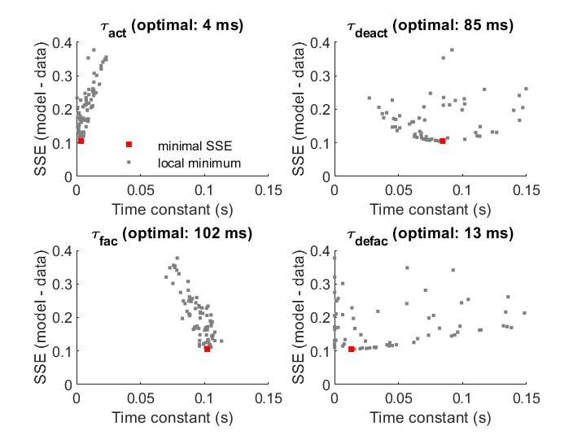
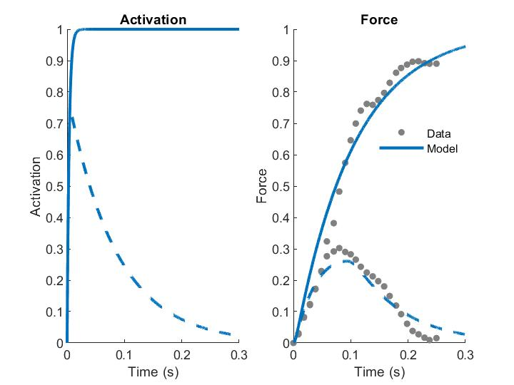

# calcium-from-force
This repository shows how tetanic and twitch force development in muscle requires the combination of two non-linear sets of dynamics. These dynamics seem to resemble:
- Calcium activation (fast rise, slow decay)
- Force development (slow rise, fast decay)

Two sets of time constants are fit on experimental data of twitch and tetanus in human quadriceps. Source: https://pubmed.ncbi.nlm.nih.gov/1549641/. Each set of dynamics has two time constants: one for the rising phase, one for the decaying phase, for a total of 4 time constants. 

_fminsearch_ is used to find values for the 4 time constants that yield a minimal sum of squared errors (SSE) between model twitch and tetanus force and experimental twitch and tetanus force. Because the obtained values appear to depend on initial guess, the SSE-minimization was repeated for relatively large number of initial guesses (default: 100, see Fig. 1). The combination of time constants that yields the lowest SSE was then used in simulation (see Fig. 2).

## Figure 1: SSE (model vs. data) for 100 different initial guesses 

## Figure 2: Twitch and tetanus (model vs. data) for optimal time constants (minimal SSE)

